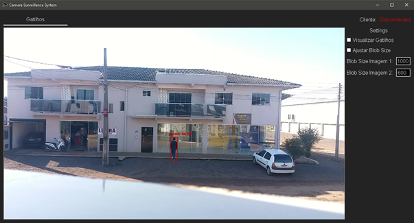
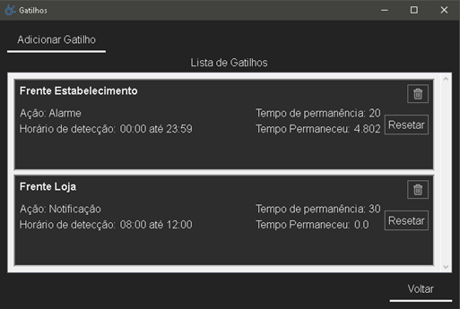
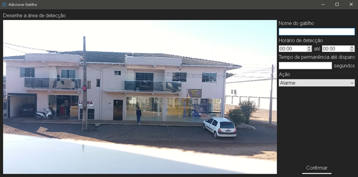
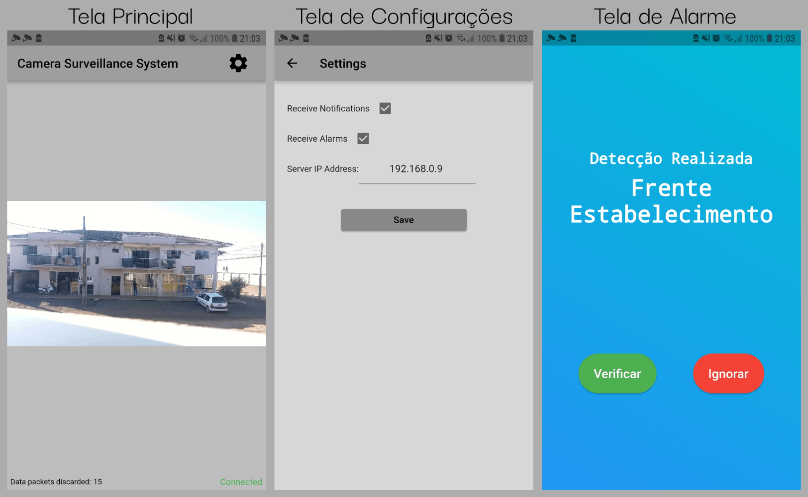

# Camera Surveillance System with Person Detection

This project's main goal is to detect suspicious presences in surveillance camera's footage using person detection to prevent home invasions.

The system for Windows allow users to create triggers that are fired when certain conditions are met, such as a person being detected in an area drawn by the user, time of the day, and the maximum amount of time the detection spends inside the area. When it fires, it sends a notification or sound an alarm on the user's phone through an Android app.

The Android app is used to receive the notifications sent by the Windows app and visualize the cameras' footage in real time.

## Screenshots

### Windows Interface
#### Home

#### Triggers Managing

#### Add Triggers

### Android Interface

## Technologies Applied

| Name                        | Purpose                   |
| --------------------------- | ------------------------- |
| [**PyQt5**](https://www.riverbankcomputing.com/software/pyqt/) | Interface para Windows |
| [**OpenCV**](https://opencv.org/) | Manipulação de Imagens e Aplicação da Rede Neural |
| [**Flutter**](https://flutter.dev/) | Interface para Android |